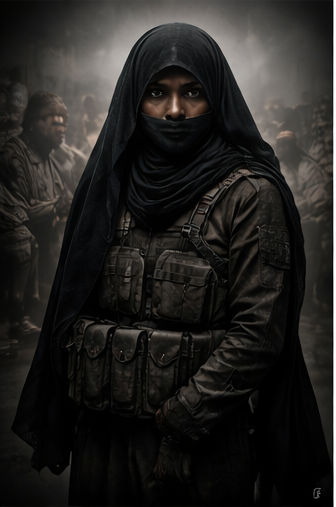
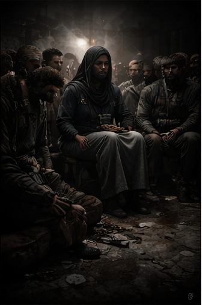
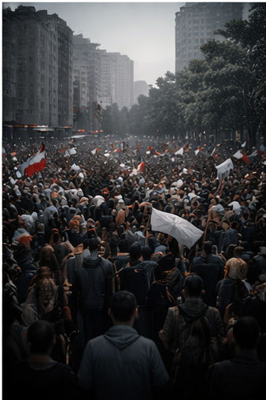

# Unmasking Moral Inversion
## How Terrorism Is Reframed Through Culture, Activism, and Selective Outrage

Unmasking Moral Inversion
How Terrorism Is Reframed Through Culture, Activism, and Selective Outrage

Introduction — What This Pamphlet Argues (and What It Does Not)
This pamphlet is not a denial of Palestinian civilian suffering. A legitimate subjects of criticism and moral concern.
Its purpose is narrower and more difficult:
to examine how acts of terrorism against civilians are rhetorically transformed into moral symbols, and how this transformation spreads through culture, academia, media, and activist networks—often without malicious intent by those who later amplify it.
The central claim is this:
When violence is stripped of agency, intent, and victims, it becomes propaganda—regardless of the cause it is attached to.
This document traces the process by which that transformation occurs.

Section I — Propaganda Beyond Lies: Moral Inversion as Method
Modern propaganda rarely relies on false facts alone. More often, it relies on selective framing:
* identity is emphasized over action,
* context over responsibility,
* symbolism over consequence.
This produces moral inversion: a condition in which perpetrators are aestheticized as victims, while victims themselves disappear from public consciousness.
This mechanism has appeared across history—from wartime propaganda to Cold War disinformation—but today it is amplified by cultural production, activist signaling, and digital media cycles.¹

Section II — Case Study: Hanadi Jaradat
The Event
On October 4, 2003, Hanadi Jaradat, a member of Palestinian Islamic Jihad, carried out a suicide bombing at the Maxim restaurant in Haifa, Israel.
The attack:
* deliberately targeted a civilian restaurant,
* killed 21 civilians, including children,
* injured more than 50 others, and
* destroyed a venue co-owned by Jewish and Arab Israeli families, widely known as a symbol of coexistence.²
These facts are uncontested and documented in contemporaneous reporting and official records.³
Jaradat was not a civilian killed in conflict; she was the agent of the violence itself.

The Reframing
In subsequent cultural and activist representations, Jaradat increasingly appears not as a perpetrator but as:
* a symbol of resistance,
* a victim of oppression,
* or a martyr figure abstracted from her actions.
The bombing itself is frequently minimized, backgrounded, or omitted.
This is not simple misinformation. It is narrative displacement:
violence remains present, but responsibility dissolves.

Section III — Gendered Exploitation in Islamist Terrorism
The use of women in Islamist terror campaigns is neither accidental nor emancipatory.
Security and counter-terrorism research consistently shows that women are deployed because they:
* attract lower suspicion thresholds,
* can access civilian and child-dense spaces more easily,
* and generate greater propaganda value after death.⁴
Recruitment mechanisms commonly involve:
* religious coercion,
* family or community pressure,
* honor-based narratives,
* or promises of posthumous redemption.⁵
To reframe such deployment as feminist resistance is to erase coercion while aestheticizing death.
Acknowledging this does not deny female agency; it restores analytical honesty.

Section IV — Cultural Mediation and Aesthetic Laundering
The Dror Feiler Exhibition
In the early 2000s, an art exhibition involving Dror Feiler featured Hanadi Jaradat depicted floating serenely in a small boat on a “sea of blood.”
The issue here is not provocation. Provocation is a legitimate artistic strategy.
The issue is aesthetic laundering:
* victims are removed,
* violence is abstracted,
* perpetrators are transformed into passive symbols.
This does not document reality; it restructures moral perception.
Art, in this context, becomes a mechanism of moral displacement, not critique.⁶

Section V — From Cultural Space to Activist Infrastructure
Symbolic narratives do not remain confined to galleries or academic discourse. They migrate:
* into NGOs,
* activist networks,
* protest movements,
* and global media cycles.
Dror Feiler later played a role in organizing early iterations of what became known as the “Freedom Flotilla” actions.
The 2010 Gaza flotilla incident, which resulted in the deaths of 10 Turkish nationals, permanently altered Israel–Turkey relations and became a foundational symbol in global pro-Palestine activism.⁷
Subsequent investigations established that some participants were affiliated with or sympathetic to Islamist organizations hostile to Israel’s existence.⁸
Many later activists are unaware of these upstream realities.
Symbolism travels faster than facts.

Section VI — Academia, Media, and Narrative Reinforcement
Academic and media institutions do not create terrorism, but they can reframe it.
Documented cases show:
* academic figures and institutions reinterpreting jihadist violence as “resistance,”
* media framing that removes civilian victims from focus,
* and rhetorical pressures that label critique of Islamist extremism as prejudice.⁹
This does not require coordination.
It emerges from ideological incentives, reputational pressures, and moral simplification.

Section VII — Selective Outrage and Moral Asymmetry
A defining feature of contemporary activism is asymmetrical mobilization.
In recent years:
* Iranian protesters—many of them women—have been imprisoned, tortured, or killed by the Islamic Revolutionary Guard Corps (IRGC),
* yet global protest mobilization has been limited compared to Gaza-focused activism.¹⁰
This raises a legitimate question:
Why does outrage mobilize instantly in some contexts, but remain muted in others where the perpetrators are ideologically inconvenient?
The answer lies less in compassion than in narrative compatibility.

Section VIII — Anti-Zionism, Jewish Dissent, and Category Collapse
Many Jewish individuals oppose Zionism or Israeli state policy, often from liberal or universalist positions.
However, contemporary activism frequently collapses distinctions:
* between anti-Zionism and antisemitic tropes,
* between state critique and collective guilt,
* between Jewish dissent and moral absolution for jihadist violence.
Opposing nationalism does not require romanticizing terrorism.

Conclusion — Moral Consistency as Resistance to Propaganda
This pamphlet does not argue for silence or allegiance.
It argues for moral consistency:
* civilians are civilians,
* terrorism is terrorism,
* context explains but does not absolve,
* symbolism must not erase victims.
When violence is aestheticized, responsibility disappears.
When responsibility disappears, propaganda succeeds.
Critical solidarity requires more than passion.
It requires discipline, memory, and clarity.

Selected References
1. Jowett & O’Donnell, Propaganda & Persuasion, 2014
2. BBC News, Haifa suicide bombing, Oct. 2003
3. Reuters & AP archives; Israeli MFA records
4. Bloom, M., Bombshell: Women and Terrorism, 2011
5. Horgan, J., The Psychology of Terrorism, 2014
6. Azoulay, A., The Civil Contract of Photography, 2008
7. UN Palmer Report, 2011
8. Turkish court records; international intelligence briefings
9. Middle East Forum reports; university case records
10. Amnesty International, Iran protest crackdowns, 2022–2023

**Content note:** This project discusses terrorism and political violence for analysis and critique. Nothing here endorses violence.

---

